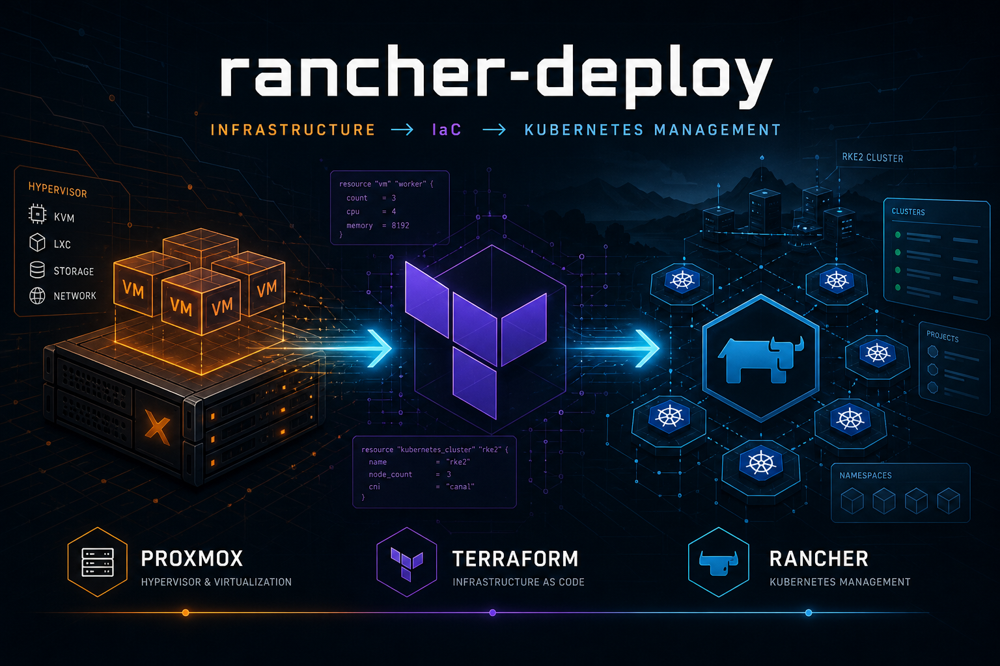

# rancher-deploy



Terraform automation that builds a Rancher management plane and hybrid RKE2 app clusters on Proxmox — Ubuntu cloud images, RKE2 bootstrap, Rancher, storage, and common operators in one apply.

## What this deploys

| Cluster | Role | Default VM IDs | Default IPs (example) |
|---------|------|----------------|------------------------|
| **manager** | RKE2 + Rancher control plane (3 servers) | 401–403 | `192.168.1.100–102` |
| **nprd-apps** | Non-prod (3 servers + 3 workers) | 410–415 | `192.168.1.110–115` |
| **prd-apps** | Production (3 servers + 3 workers) | 420–425 | `192.168.1.120–125` |
| **poc-apps** | POC / test (3 servers + 3 workers) | 430–435 | `192.168.1.130–135` |

Also automated when enabled in `terraform.tfvars`:

- **cert-manager** + **Rancher** on the manager cluster
- Downstream registration into Rancher
- **Democratic CSI** (TrueNAS NFS) and/or official **TrueNAS CSI** on app clusters
- **Envoy Gateway** + **kube-vip** LoadBalancer IPs on app clusters
- Operators: CloudNativePG, MongoDB Community, OpenSearch, GitHub ARC
- Optional **Palworld operator** (default: **prd-apps** only)

Topology detail: [docs/ARCHITECTURE.md](docs/ARCHITECTURE.md).

## Prerequisites

- Terraform ≥ 1.5, `curl`, `ssh`, `jq`
- Proxmox VE 8/9 with an API token ([docs/API_TOKEN_AND_PERMISSIONS.md](docs/API_TOKEN_AND_PERMISSIONS.md))
- SSH key pair for VM access (repo convention: `.keys/`, gitignored)
- DNS for Rancher / cluster hostnames ([docs/DNS_CONFIGURATION.md](docs/DNS_CONFIGURATION.md))
- Optional: `kubectl`, `helm` for day-2 ops

```bash
make check-prereqs
make check-rancher-tools   # optional
```

## Quick start

```bash
# 1. Deploy key (example — keep private keys out of git)
mkdir -p .keys
ssh-keygen -t ed25519 -f .keys/id_rsa -N "" -C "rancher-deploy"

# 2. Configure
cp terraform/terraform.tfvars.example terraform/terraform.tfvars
# Edit Proxmox API, SSH path, Rancher hostname/password, DNS, storage, etc.
# ssh_private_key = "/absolute/or/relative/path/to/.keys/id_rsa"
# Public key is read from "${ssh_private_key}.pub"

# 3. Deploy
make init
make plan
make apply                 # wraps ./scripts/apply.sh (logged)
# or: ./scripts/apply.sh
```

Verify:

```bash
export KUBECONFIG=~/.kube/rancher-manager.yaml && kubectl get nodes
export KUBECONFIG=~/.kube/nprd-apps.yaml && kubectl get nodes
export KUBECONFIG=~/.kube/prd-apps.yaml && kubectl get nodes
export KUBECONFIG=~/.kube/poc-apps.yaml && kubectl get nodes
```

Destroy: `make destroy` or `./scripts/destroy.sh`.

Full walkthrough: [docs/DEPLOYMENT_GUIDE.md](docs/DEPLOYMENT_GUIDE.md).

## Documentation

**[docs/README.md](docs/README.md)** — full index.

| Topic | Doc |
|-------|-----|
| Architecture | [ARCHITECTURE.md](docs/ARCHITECTURE.md) |
| Deployment | [DEPLOYMENT_GUIDE.md](docs/DEPLOYMENT_GUIDE.md) |
| SSH keys & recovery | [SSH_AND_ACCESS.md](docs/SSH_AND_ACCESS.md) |
| DNS | [DNS_CONFIGURATION.md](docs/DNS_CONFIGURATION.md) |
| TrueNAS / Democratic CSI | [DEMOCRATIC_CSI_TRUENAS_SETUP.md](docs/DEMOCRATIC_CSI_TRUENAS_SETUP.md) |
| TrueNAS CSI migration | [TRUENAS_CSI_MIGRATION.md](docs/TRUENAS_CSI_MIGRATION.md) |
| Troubleshooting | [TROUBLESHOOTING.md](docs/TROUBLESHOOTING.md) |
| Ops notes | [OPS_NOTES.md](docs/OPS_NOTES.md) |
| Example homelab diagram | [examples/homelab/index.html](examples/homelab/index.html) |

## Project layout

```
├── Makefile                 # init / plan / apply / destroy helpers
├── scripts/                 # apply.sh, destroy.sh, CSI/ARC helpers
├── docs/                    # guides + assets/
├── examples/                # reference diagrams (e.g. homelab topology)
├── helm-values/             # examples (generated values are gitignored)
├── config/                  # local tokens / secrets (gitignored)
├── .keys/                   # deploy SSH keys (gitignored)
└── terraform/               # root module + modules/ + environments/
```

## Secrets

Never commit `terraform.tfvars`, `.keys/`, `config/*`, or generated Helm values with API keys. Examples and templates are tracked; live credentials are not.

## License

MIT — see project license files. Contributing: [CONTRIBUTING.md](CONTRIBUTING.md).
